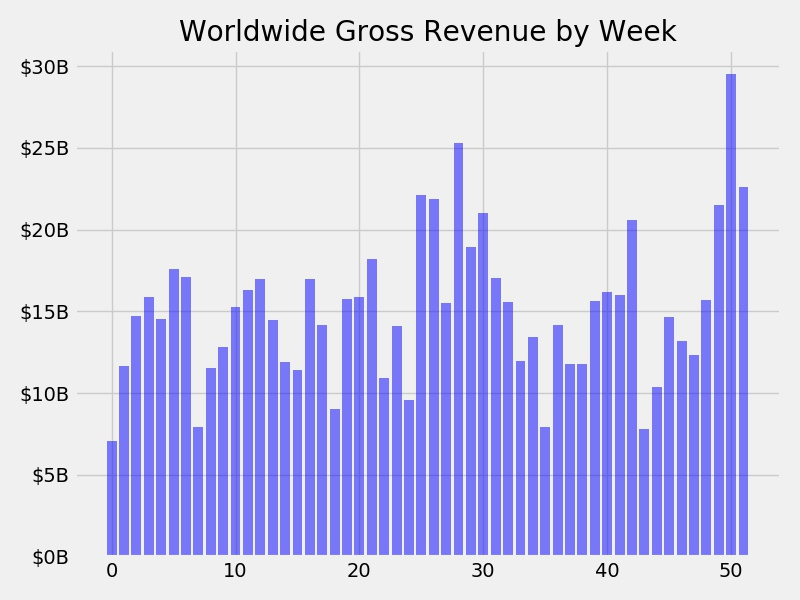
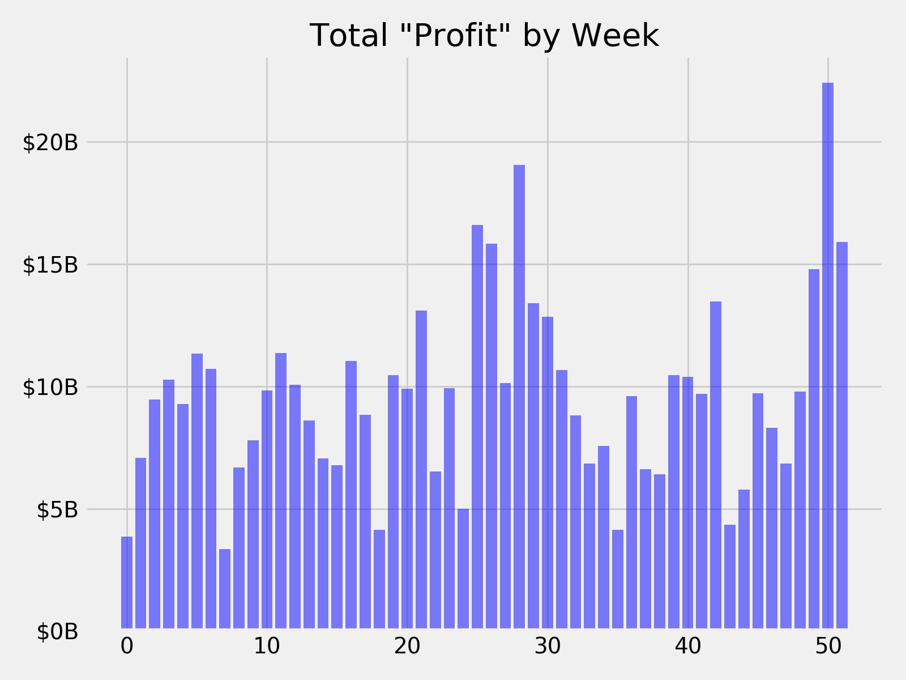
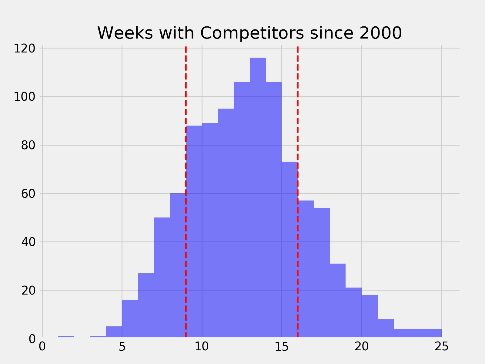

# FILM SEASONALITY

## Background

I've been curious about seasonality and competition in the film industry for years. Is there a good reason why big budget, super-hero/action movies seem to come out mostly in the summer or during the end of the year? Are they more likely to be successful in those times of year? What effect (if any) does the competition play in film success? As a consumer, I like Fast and Furious movies just as much in February as I do July, but I only have so much time to go to the theater. When there are several movies out I want to see, I probably only get a chance to 1 or 2 of them. Does it make sense to cluster some releases in the summer and end of year? Am I am the only one annoyed by this?

Every industry contains a certain set of unwritten rules or stories that identify standard behaviors and set out what it takes to make money. In the film industry, it seems that one of the most common and pervasive of these rules is that the season in which a film is released has an outsized effect on the chances of its success. Studios have created stories (as in mental narratives that state a perspective on how the world works) about consumer behaviors and the relationship between those behaviors and the probability of success for any particular film. 

Some of these stories, however, aren’t necessarily evaluated for their validity; they are the result of decades of releasing movies in this pattern. Further, these stories are reinforced by reality; since a studio will only try to release a film they expect to be a hit during a window in which they think it will become one, hits generally occur (or are perceived to occur) during those windows.

As an example of this type of behavior, per the movie tracking website The Numbers:
- Since 1990, there have been 77 films released that:
    - Are G-rated
    - Were made in the US
    - Have a budget of at least $1M
- Of these films, over 43% have been released in June and November.
- Zero have been released in the month of September. Why not? It seems at least possible that there exists some pervasive belief that a kids movie can't be successful in September.

# THIS IS FOR YOU KAYLA

## The Data

This dataset was scraped from IMDB. It contains over 80,000 movies from all over the world going back to 1910. For the purposes of this analysis, the salient features are:
- Financials
    - Budget - how much did the film cost to produce (not including marketing or other overhead costs)
    - Worldwide Gross - how much did the film take in from theaters worldwide
- Release date - when was the film released
- Genre - IMDB classifies a film into one or more of 18 genres. However, each film has no more than 3 genre classifications.

In order to understand the effects of seasonality on film performance, I filtered out the vast majority of films from the dataset. The filters were:
- The film must have a reported budget without which the could be no analysis of profitability/performance.
- The film's budget must be denominated in USD. Foreign-produced films are beyond the scope of this analysis.
- The film must have a reported US Gross revenue. If a film was made here, but never released here, it is also beyond the scope of this analysis.
- The film was released in 1970 or later. This cuts out the oldest 120 movies - from a time when far fewer films came out and there was much less competition.
The resulting dataset is ~7100 films, dating from 1970 to 2019.

## EDA/Initial Observations

I wanted to see if we could observe seasonality across the course of the year, so I aggregated total revenue by week of the year (0 - 51).

I also wondered if higher budget movies are released in any sort of seasonal patter, so I plotted total budget by release week, as well.

The difference here would be commonly conceived of as the profit:

But, this doesn't really tell the whole story for a couple of reasons. First, the publicly available data for the budget of a film does not include any costs other than the production of the film itself. It excludes marketing costs (a HUGE number - commonly considered to be 60-100% of the budget of the film) and all other overhead. 

Second, wildly successful films play an outsized role in profit generation. In some ways, the movie business is resistant to analysis of raw numbers; real success is all about outliers. It only takes one *Titanic* to pay for a lot of *Sharknados*. 

For example, the most profitable week of the year is week 50 (Christmas week). In the dataset, there are 133 films released in week 50, but **about 20% (or roughly $5B) of the total profit** of that week is attributable to two films, *Avatar* and *Star Wars: Episode VII*. Massive hits like these are by definition outliers (and outliers are hard to predict or analyze). 

Further, even focusing on 'return' alone can be challenging. For example, *The Blair Witch Project* made ~$250M on its paltry $60k budget (roughly a 416,667% return). Analyzing returns while including these outliers would have the potential to lead us astray.

Thus, for the purposes of this analysis, it makes more sense to focus on commercial success - that is, sufficient return on the investment. Using both my own experience and a small survey of people in the industry, I landed on a threshold of three times the budget in order for a film to be considered commercially successful. Using this metric for success, I plotted the rate of success for films across the year, as well as the mean budget of the films by week, and the 'supply' or count of films per week. I was most interested in investigating the summer and winter windows. These windows (hereafter referred to as 'prime') run from the 20th to the 32nd weeks, late May to the beginning of August, and the 47th to the 51st weeks, Thanksgiving to the end of year.

A couple observations about this:
1. The mean budgets for these weeks are higher than average and the supply is below average.
2. Mean supply/count of movies are lower in the windows

**The primary question of this analysis is what role seasonality and supply play in film success.**

## Hypothesis Test #1 - Prime Window

First, I wanted to test whether or not being released in one of the prime windows has a significant effect on film success.

| Status | Successes | Attempts | Success Rate |
| --- | --- | --- | --- |
| Prime | 660 | 2143 | 0.308 |
| Not Prime | 1328  | 4973 | 0.267 |

1. Null hypothesis is that prime window success rate is equal to not prime window success rate. Alternative hypothesis is that the prime window success rate is greater than not prime.

2. One tailed z-test, alpha = 0.05

3. z-score = 3.53, test_statistic = 0.0004

4. Reject the null - prime window does outperfom not prime window

## Hypothesis Test #2 - Competitive Effect

To examine the role of supply (or competition) in film success, I used the count of films released the week before, the week of, and the week after a film's release, so for every film in the dataset, we know how many 'competitors' it has. I chose this window because the lion's share of a film's theatrical revenue comes in the first two weekends. I chose to break the dataset into three parts - low competition (~27% of weeks), high competition (~25% of weeks), and middle competition (~48% of weeks). 

| Competition | Successes | Attempts | Success Rate |
| --- | --- | --- | --- |
| Low | 362 | 943 | 0.384 |
| Middle | 916 | 3287 | 0.279 |
| High | 710 | 2886 | 0.246 |

I then performed two hypothesis tests - low vs. middle and high vs. middle. Since I am doing two comparisons, I used an alpha of 0.025 (Bonferroni correction for an alpha of 0.05).

#### Hypothesis Test #2A - Low v. Middle

- Null Hypothesis: Success rate for low competition films is equal to success rate for middle competition films. Alternate hypothesis is that low competition films outperform middle competition films.

- One tailed z-test, alpha = 0.025

- z-score = 6.229, test_statistic = 2.344e-10

- Reject the null - low competition films outperform middle competition films.

#### Hypothesis Test #2B - High v. Middle

- Null Hypothesis: Success rate for high competition films is equal to success rate for middle competition films. Alternate hypothesis is that high competition films underperform middle competition films.

- One tailed z-test, alpha = 0.025

- z-score = -2.908, test_statistic = 0.002

- Reject the null - high competition films underperform middle competition films.

That seasonality and competitive set are significant is (potentially) unsurprising. The surprising thing was how significant the results were, which led me to consider why this might the case. The first thing that came to mind was time. Older films have much higher success rates:

Indeed, the mean year for the low competititon films is 1986; for the high competition films, the mean year is 2008.

## Hypthesis Test #3 - Competitive Effect - Films since 2000

I filtered down the dataset to just films released this century, some 4600 films. Same as above, I broke the dataset into three parts (low, middle, and high competitive weeks).

| Competition | Successes | Attempts | Success Rate |
| --- | --- | --- | --- |
| Low | 252 | 731 | 0.345 |
| Middle | 736 | 2610 | 0.282 |
| High | 290 | 1267 | 0.229 |

#### Hypothesis Test #3A - Low v. Mid for the 2000s

- Null hypothesis is that success rate of low competition films is the same as middle competition films. Alternative is that low competition films outperform middle competition films.

- One tailed z-test, alpha = 0.025

- z-score = 3.29, test_statistic = 0.0005

- Reject the null - low competition films outperform middle competition films

#### Hypothesis Test #3B - High v. Mid for the 2000s

## Some conclusions......

Though the hypothesis tests show that the prime window and the competitive set almost definitely have an effect on the success rate of a film, it's pretty clear that there are some confounding factors/overlap that prevent a cleaner analysis. Prime window releases are not exactly the same as low competition releases, but studios do seem to constrain supply during prime windows. Also, it's impossible to prove a counter-factural; we can't say movie would have different performance with a different release date. A movie can only be released once.    

## One more try......Big Budget Films

I decided to filter down the dataset again. This time, I wanted to look only at the biggest films released since 2000. I took the top quartile of films by inflation adjusted budget to create the below:

- Weeks 18 and 19 are very interesting - prime adjacent and they have the lowest (0%) and highest (68%) success rates
- Mean budget for prime window is ~$130M v ~$104M for not prime
- Still seems like there is a relationship between success and season, as well as success and competition.

### Hypothesis Test #1: Prime v Not Prime

| Status | Successes | Attempts | Success Rate |
| --- | --- | --- | --- |
| Prime | 171 | 441 | 0.388 |
| Not Prime | 211 | 711 | 0.297 |

- Null hypothesis is that prime window success rate is the same as not prime window success rate. Alternative hypothesis is that prime window outperforms not prime window.

- One tailed z-test, alpha = 0.05

- z-score = 3.2, test_statistic = 0.0007

- Reject the null - prime window outperforms not prime window

### Hypothesis Test #2: Competitive Effect

| Competition | Successes | Attempts | Success Rate |
| --- | --- | --- | --- |
| Low | 84 | 184 | 0.456 |
| Middle | 240 | 754 | 0.318 |
| High | 58 | 214 | 0.271 |

##### Test #2A: Low v. Mid

- Null hypothesis is that success rate of low competition films is the same as middle competition films. Alternative is that low competition films outperform middle competition films.

- One tailed z-test, alpha = 0.025

- z-score = 3.555, test_statistic = 0.0002

- Reject the null - low competition films outperform middle competition films

##### Test #2B: High v. Mid

- Null hypothesis is that success rate of high competition films is the same as middle competition films. Alternative is that high competition films underperform middle competition films.

- One tailed z-test, alpha = 0.025

- z-score = -1.322, test_statistic = 0.093

- Cannot reject the null.

## Conclusions Part Deux

Many of the same confounding variables are still present in the big budget films, though possibly to a lesser effect. 